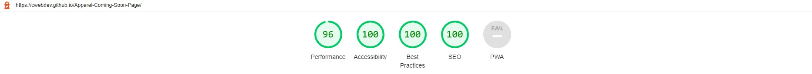

# Apparel Coming Soon Page (PSD to HTML)

This is a solution to the [Base Apparel coming soon page challenge on Frontend Mentor](https://www.frontendmentor.io/challenges/base-apparel-coming-soon-page-5d46b47f8db8a7063f9331a0).

Live Site Link: https://cwebdev.github.io/Apparel-Coming-Soon-Page/

## Table of contents

- [Overview](#overview)
  - [Description](#description)
  - [Screenshot](#screenshot)
  - [Links](#links)
- [My process](#my-process)
  - [Built with](#built-with)  
- [Author](#author)

## Overview

An apparel brand coming soon page (responsive website) developed from PSD using HTML, CSS and JavaScript.

### Description

This "coming soon" page of apparel brand is developed in HTML5, CSS3 and JavaScript from PSD design. Page is responsive in web and mobile screens. Site performs very well in Google lighthouse performance metrics.

### Lighthouse Screenshot

### Desktop Screenshot

#### Mobile Screenshot

### Links

## My process

### Built with

- Semantic HTML5 markup
- Mobile-first workflow
- BEM (Block, Element, Modifier) Class Naming Convention

## Author

- Website - [Chitrang Shah](https://chitrang.webflow.io/)
- Frontend Mentor Profile - [@cwebdev](https://www.frontendmentor.io/profile/cwebdev)